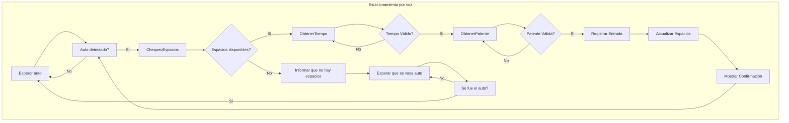

# Estacionamiento por voz e IA

Para el proyecto se decidió utilizar `python3` y `fastai`.

```mermaid
flowchart TD
    subgraph Estacionamiento por voz
        Z[Esperar auto] --> A[Auto detectado?]
        A --> |Sí| B[ChequeoEspacios]
        A --> |No| Z
        B --> C{Espacios disponibles?}
        C -->|Sí| D[ObtenerTiempo]
        D --> E{Tiempo Válido?}
        E -->|No| D
        E -->|Sí| F[ObtenerPatente]
        F --> G{Patente Válida?}
        G -->|No| F
        G -->|Sí| H[Registrar Entrada]
        H --> I[Actualizar Espacios]
        I --> J[Mostrar Confirmación]
        C -->|No| K[Informar que no hay espacios]
        K --> L[Esperar que se vaya auto]
        J --> A
        L --> M[Se fue el auto?]
        M --> |No| L
        M --> |Sí| Z
    end
```

