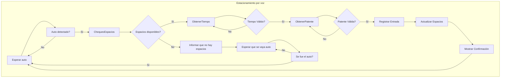

# Aparcamiento por voz e IA

Para el proyecto se decidió utilizar `python3`, `pyttsx3` y `whisper`.

## Estado del proyecto:
- [X] Primera implementación de estructura.
- [X] Estructura del proyecto
- [X] Captura de audio
- [X] Implementacion de IA
- [ ] Simular sensores vehiculo

## Probrar el proyecto

Para poder probar el proyecto es necesario setear el entorno de desarrollo.

### 1. Clonar el repo.

~~~sh
git clone git@github.com:EstacionamientoPorVoz-Prog3/aparcamiento-por-voz && cd aparcamiento-por-voz
~~~

O con `https`:

~~~sh
git clone https://github.com/EstacionamientoPorVoz-Prog3/aparcamiento-por-voz && cd aparcamiento-por-voz
~~~

### 2. Crear y setear ambiente virtual

~~~sh
python -m venv .venv && source .venv/bin/activate
~~~

Luego es necesario instalar las dependencias:

~~~sh
pip install -r requirements.txt
~~~

### 3. Para correr el proyecto

~~~sh
python -m estacionamiento
~~~
